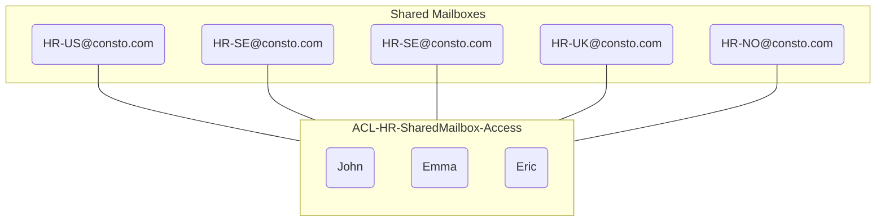

## Microsoft Entra ID Groups

Microsoft Entra ID enables us to create multiple of groups such as Security Group, Microsoft 365 Group, and Mail-Enabled Security Group and each one of these groups are used for different purposes. 

- Microsoft 365 Group: Collaboration on Teams, SharePoint, and Planner.
- Security Group: Managing access to File-Shares and Licenses.
- Mail-Enabled Security Group: Managing access to multiple of Shared Mailboxes.

The Security Group and Microsoft 365 Group state can either be Assigned or Dynamic.

- Assigned: Administrator needs to manually add the user into the group.
- Dynamic: Automatically added into the group if the attributes matches.

**When should you use Microsoft 365 Group?** It's recommended to use Microsoft 365 Groups when doing collaboration work where internal/external entities will be working together as this will allow them to use Teams, SharePoint, Planner, and much more...

**When should you use Security Group?** It's recommended to use Security Groups to manage access to file-shares, licenses, and Azure resources.

**When should you use Mail-Enabled Security Group?** It's recommended to use Mail-Enabled Security Group for managing access to multiple of Shared Mailboxes. This will allow us to quickly remove a user access to multiple of mailboxes without manaually removing them from all the shared mailboxes. Here's an example scenario where Mail-Enabled Security Group would be useful.

**Scenario** 

HR Departement needs us to create multiple of shared mailboxes and everyone in HR departement should have access to these shared mailboxes. 

| Email            | Information                       |
| ---------------- | --------------------------------- |
| HR-US@consto.com | Include everyone in HR Department |
| HR-SE@consto.com | Include everyone in HR Department |
| HR-UK@consto.com | Include everyone in HR Department |
| HR-NO@consto.com | Include everyone in HR Department |

The most efficient and recommended way of implementing solution for the scenario is to do the following.

We can create a Mail-Enabled Security group named ACL-HR-SharedMailbox-Access and add that as a member of the shared mailboxes. This is great for access management as once the user is removed from ACL-HR-SharedMailbox-Acces the user will lose access to all the shared mailboxes.

## Intune

Microsoft Intune is a device management system that allows companies to manage their devices and the company data stored within the devices. It also supports Bring Your Own Device (BYOD) concept which allows employees to enroll their personal devices to access company data. Microsoft Intune also allows us to enforce policies such as Configuration Policy, App Protection Policy, App Deployment Policy, and much more to manage company devices.

Microsoft Intune also simplifies the life management of devices to the concept enroll, configure, protect, and retire once the device is no longer in use. 

- Enroll: Enrolling computers, laptops, and mobile devices to Microsoft Intune.
- Configure: Creating configuration policies, app protection policies, and app deployment policies.
- Protect: Monitoring devices to ensure the computers, laptops, and mobile devices are receiving the latest updates.
- Retire: Removing the computers, laptops, and mobile devices which are no longer in use.

When an device has been enrolled to Microsoft Intune the policies and applications are automatically setup by Windows Autopilot. Currently, Microsoft Intune is only supported on the following devices and operating systems.

| Device Types | Operating Systems |
| ------------ | ----------------- |
| Computers    | Windows           |
| Laptops      | MacOS             |
| Phones       | Linux (Ubuntu)    |
| IoT          | Android & iOS     |

Once Microsoft Intune has been setup on our environment we can enroll a Windows 10 and Windows 11 device using the following commands:

1. `FN + SHIFT + F10`
2. `wmic bios get serialnumber`
3. `powershell.exe -ep bypass`
4. `install-script get-windowsautopilotinfo -force`
5. `set-executionpolicy -scope process -executionpolicy remotesigned`
6. `get-windowsautopilotinfo -online -GroupTag [GROUP-NAME]`

