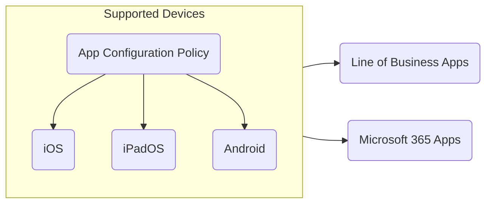

## Introduction

I spent some time working with Microsoft Intune this year, and around a month ago I became interested in learning more about it since I was interested at knowing the different features and best practices that organization's uses with Microsoft Intune.

The Microsoft Endpoint Administrator Associate has so far been one of the most difficutl certification's which I have studied for sicne it had a lot of information's about Micosoft Intune which I was unfamiliar with. However, it was exciting and fun to learn to learn about it as it expanded my knowledge about things which I was unfamiliar with.

## Preperation

I mostly spent my time learning about Microsoft Intune on [Microsoft: MD-102](https://learn.microsoft.com/en-us/credentials/certifications/modern-desktop/) as it contained a lot of information's about:

- Using the Enterprise Desktop Life Cycle as best practices for purchasing, managing, and retiring devices.
- Configuring configuration profiles.
- Configuring administrative templates, device restriction, and etc...
- Implementing Microsoft Defender using endpoint & detection policies.
- Securing devices and coperate using account protection policies and app protection policies.
- Increasing security of organziation using Windows Hello for Business.
- Improving effectiveness of Microsoft Intune using tools such as endpoint analytics.

Many of these things were unfamiliar for me and after learning about it; I decided to put these things into practice by troubleshooting Microsoft Intune problems which I was experiencing at my workplace. And I also signed up for a Microsoft Intune Trial which allowed me to play around with Microsoft Intune on my own environment for 30 days. I also spent some time creating graphs about features to memorize all the information's.

**App Configuration Policy:**

## Exam Attempt #1

At 10 of May I got home from work and started studying for Microsoft Endpoint Adminsitrator Associate certification and after studying for few hours I decided to check if any exam seats were available and saw one which was available within 30 minutes. I quickly purchased the exam and relaxed for 20 minutes and joined the exam. Here's a overview of my experience with the exam:

- Case study were easy
- Multiple of choices were extremely difficult
- Non-skippeable multiple of choices were extremely difficult and questions were formulated in a weird way

After finishing all the questions I decided to end the exam and saw that I failed with 635 points. I felt extremely disapointed of myself since I have never failed an certification but this was an good learning experience as it pushed me to learn more.

## Exam Attempt #2

At 17 of July, I was home and preparing for Microsoft Administrator Associate certification and I was now fully confident with Microsoft Intune as I had spent time working with it and working on the labs with it. When I went to PersonVUE, I saw an exam seat was available so I purchased it and joined the exam instantly. Here's a overview of my experience with the exam:

- Case studies felt extremely easy
- Multiple of choices were easy and I managed quickly finish them off
- Non-skippeable multiple of choices took a bit time

Once I was finished with all the questions I reviewed all my answers and I was confident that I was going to pass so I ended the exam and saw that I passed with a score of 935 which is so far the highest score I have gotten in a Microsoft certification.

## Conclusion

I highly recommend people who works with Microsoft Intune to take the Microsoft Endpoint Administrator Associate certification as it will teach you a lot of new things which you are not familiar with and it will give you an better understanding about Microsoft Intune. You shouldn't expect to pass with your first try as the certification is more difficult than most associate certifications. So far in my journey my best accomplishment is to say ["I'm a Certified Endpoint Administrator Associate"](https://learn.microsoft.com/api/credentials/share/en-us/Husenjan/1DDB60C27AC1F814?sharingId=7C7334F06B6A5AA4) 😅.

