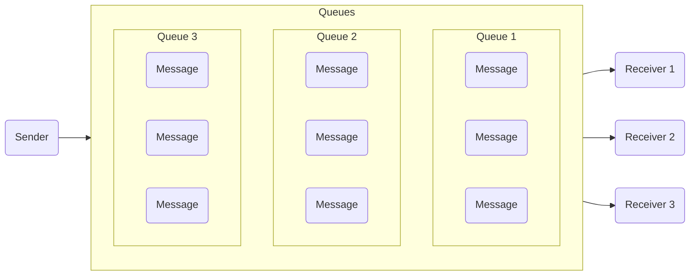
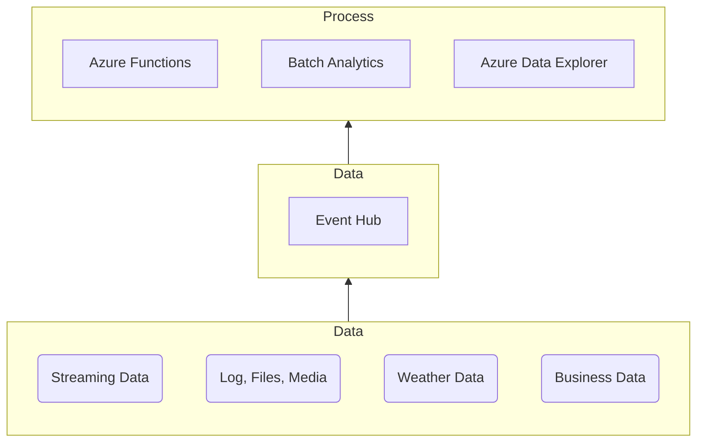

## Introduction

I obtained the [**Azure Security Engineer Associate (AZ-500)**](../az-500-review) certification for a month ago and right after passing it. I decided to get the [**Azure Solution Architect Expert (AZ-305)**](https://learn.microsoft.com/en-us/credentials/certifications/exams/az-305/) certification since the knowledge obtained from AZ-104 and AZ-500 correlates with AZ-305.

##  Preperation

As always I first read through the [**Microsoft Learn: Designing Microsoft Azure Infastructure Solutions**](https://learn.microsoft.com/en-us/credentials/certifications/exams/az-305/) course. While going through the course I took notes and created graphs to further increase my understanding about Azure resources and features. Here is a example of the graphs which I make during the note taking process:

**Azure Service Bus**

**Azure Event Hub**

I also spent a lot of time going through my notes and researching the Azure resources and features which I wasn't familiar with such as:

- Azure Service Fabric
- Azure Cache for Redis
- Azure Application Insights
- Azure Data Lake
- Azure Data Factory
- Azure IT Service Management Connector
- Azure NetApp
- Azure Diagnostic Extension
- Azure HDInsights
- Azure SQL Analytics

Once I was familiar with these Azure resources and features, I spend decent amount of time re-calling the things which I learned throughout AZ-104, AZ-500, and AZ-305 course materials.

## Exam

Today at 20:00, I was going through my notes and re-calling the things which I forgot. Out of boredom I decided to check if there were any AZ-305 exam seats available on PersonVUE and I saw one was available at 20:30 so I quickly purchased it and joined the AZ-305 exam.

My adrenaline was extremely high during the AZ-305 exam as I was taking the exam without fully preparing for it which is abnormal for me. Here's a overview of my experience with AZ-305 exam: 

- Multiple of choices were difficult but I quickly went through all of these questions as my adrenaline was high.
- Non-skipeable multiple of coices wasn't going my way as I was speed reading through some of the questions and probably got one or two questions wrong.
- Case study was difficult but I was confident which the answers which I selected as I have been researching Azure for a long-time now.

I finished 59 questions in 45 minutes and accidentally ended up pressing the end button on the exam and my adernaline became even higher once I saw the result of 780 score. I was extremely reliefed and happy that I managed to pass the Azure Solution Architect Expert certification. 

## Conclusion

I successfully managed to pass the Azure Solution Architect Expert certification and I would highly recommend taking the certification as it contains a lot of information about designing, implementing, and integrating Microsoft Azure to our environment and it also goes through the best practices that Microsoft recommends. If you're a specialist considering takig Azure Solution Architect Expert certification I would highly recommend taking it.