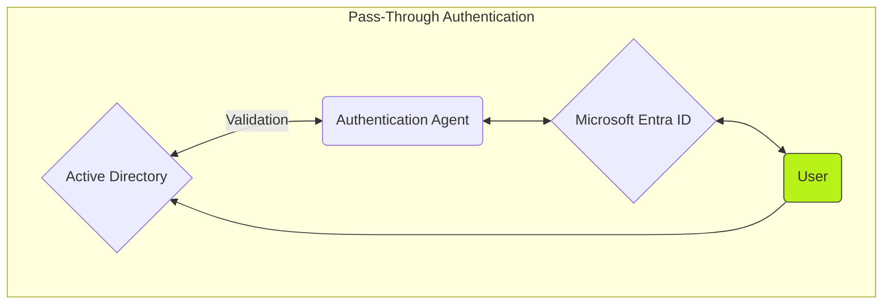

## Introduction

The [**Azure Security Engineer (AZ-500)**](https://learn.microsoft.com/en-us/credentials/certifications/exams/az-500/) certification goes through different Azure resources and Azure security features that can be used to secure our Azure environment. I recently decided to take that certification because Azure Security facinates me and since that knowledge can come in good use while working with Azure.

## Preparation

First, I read through the [**Microsoft Learn: Azure Security Engineer**](https://learn.microsoft.com/en-us/credentials/certifications/exams/az-500/) course and while going through the course I followed the exercies in my own Azure environment. Here's a overview of the things that were covered in the course.

- Microsoft Entra ID
- Microsoft Entra ID Licenses
- Microsoft Entra ID Groups
- Microsoft Entra ID Roles
- Azure RBAC Roles
- Microsoft Entra ID Protection
- Conditional Access
- Zero Trust
- Microsoft Entra PIM
- Microsoft Defender for Cloud/Endpoint/Servers/Storage/Key Vault
- Azure Enterprise Application
- Azure Blueprints
- Azure Bastion
- Azure Key Vault
- Azure SQL
- Azure Firewall
- Managed Identities
  - User-Assigned Identities
  - System-Assigned Identities
- Azure Event Hub
- Azure Logic App
- Azure Geography

Once I was completely finished with the Microsoft course materials, I decided to dig deeper into the different Azure resources and Azure security features by creating diagrams about them.

The diagrams significantly increased my understanding about Azure as it forced me to reference different Azure resources and Azure security features together. After creating multiple of diagrams and linking resources together I decided to do multiple of choices from the internet.

## Exam

When I'm studying for an certification I tend to over study therefore I decided to book the exam at 09:00 AM at 11/02/2024. The day I was going to take the exam I was extremely nervous but once the exam started I became even more nervous as the exam had 57 questions including case study, and labs.

- Multiple of choices were extremely difficult and I spent decent amount of time finishing them all.
- Non-skipeable multiple of choices were easy and I managed to finish them off relatively quickly.
- Case Study had difficult questions but I had to rush through them as I had little amount of time left to finish off the labs.
- Labs were the worst part of the exam as I had 7 minutes to finish them off and I only managed to finish 4 off before the time ran out.

Unfortunately, the time ran out before I could finish of all the lab questions therefore I thought that I failed the exam because usually when you pass a Microsoft certification a congratulation page shows up but in this case it did not show up. However, when I visited my Microsoft profile I saw that I had successfully passed the [**Azure Security Engineer (AZ-500) certification**](https://learn.microsoft.com/api/credentials/share/en-us/Husenjan-6066/63DB89B5064D17FF?sharingId=7C7334F06B6A5AA4). 

