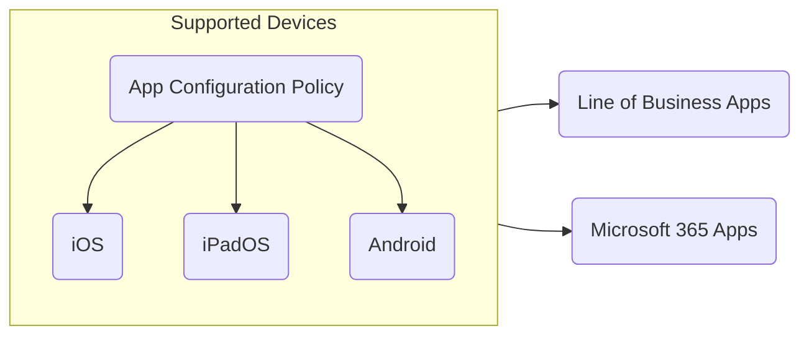

## Introduction

I spent some time working with Microsoft Intune this year and became interested in learning more about it since it's widely used and well respected across different organization's. The Microsoft Endpoint Administrator Associate (MD-102) was the perfect certification to learn more about Microsoft Intune.

## Preparation

I mostly spent my time learning about Microsoft Intune on [Microsoft Learn: MD-102](https://learn.microsoft.com/en-us/credentials/certifications/modern-desktop/) as it contained a lot of information's about:

- Using the Enterprise Desktop Life Cycle as best practices for purchasing, managing, and retiring devices.
- Configuring configuration profiles.
- Configuring administrative templates, device restriction, and etc...
- Implementing Microsoft Defender using endpoint & detection policies.
- Securing devices and coperate using account protection policies and app protection policies.
- Increasing security of organziation using Windows Hello for Business.
- Improving effectiveness of Microsoft Intune using tools such as endpoint analytics.

I was unfamiliar with many of these things and after learning about it; I decided to put these things into practice by troubleshooting Microsoft Intune problems which I was experiencing at the workplace. I also signed up for a Microsoft Intune Trial which allowed me to play around with Microsoft Intune on my own environment for 30 days. While playing around Microsoft Intune, I also went through my notes and created mermaid graphs to better memorize the information's.

## Exam Attempt #1

At 10 of May, I got home from work and started instantly studying for the Microsoft Endpoint Administrator Associate certification and after studying for a few hours I decided to book my exam and saw that one seat was available within 30 minutes. So, I quickly purchased the exam and took a break for 20 minutes and then joined the exam. Here's a overview of my experience with the exam:

- case Studies were easy and I completed it fairly quickly
- Multiple of choices questions where extremely difficult
- Non-skippable multiple of choices were extremely difficult and some of the questions were formulated in a weird way

After finishing all the questions and case study, I delivered in the exam and saw I failed with 635 points. I felt disappointed of myself since I have never failed a certification but this was a good experience as it pushed me to learn more about Microsoft Intune.

## Exam Attempt #2

At 17 of July, I was home and preparing for Microsoft Administrator Associate certification and saw one seat was available within 1 hour. So, I quickly purchased the exam and took a hour break and then joined the exam. Here's a overview of my experience with the exam:

- Case studies were extremely easy
- Multiple of choices were easy and I managed quickly finish them off
- Non-skippable multiple of choices questions were difficult and took a bit time

Once I was finished with the questions and case study, I decided to review all of my answers to ensure they were correct and once I was finished reviewing them all I delivered the exam and saw a passing score of 935 points!

## Conclusion

The Microsoft Endpoint Administrator Associate (MD-102) certification is great for IT professionals who are working with Microsoft Intune frequently as it will help you have better understand the product and the correct way to troubleshoot issues with the product.
